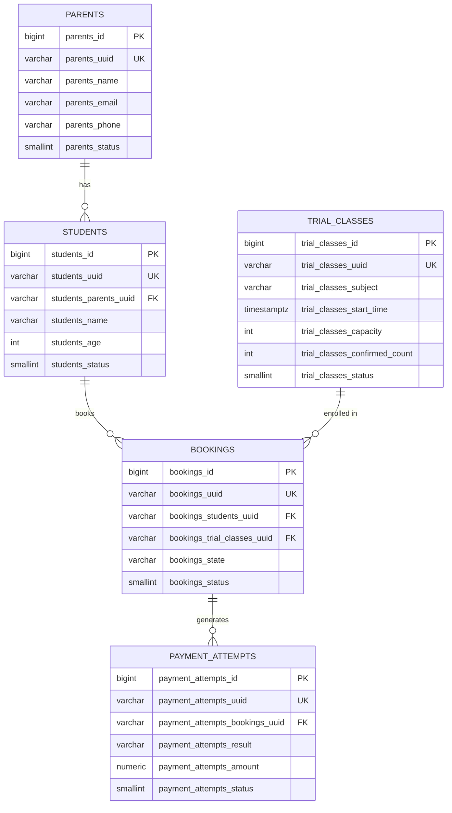

# Ottodot Trial Booking System

## Live Demo

- **Parent Trial Booking Page**: [https://ottodot-science-llej.vercel.app/en/booking](https://ottodot-science-llej.vercel.app/en/booking)
- **Teacher / Admin Class Roster**: [https://ottodot-science-llej.vercel.app/en/roster](https://ottodot-science-llej.vercel.app/en/roster)

> **Note for Reviewers**: The live deployment is pre-seeded with real database records (including parent accounts, empty trial classes, and near-capacity classes). You can interact with and test all edge cases directly in the browser without any manual setup. Local setup and testing instructions are provided below if you prefer to inspect the database or run concurrency test suites locally.

---

## Overview

Ottodot Trial Booking System is an end-to-end trial class reservation platform designed for children's science and math education, strictly enforcing a maximum capacity of 4 students per class. The primary engineering focus is **rock-solid backend reliability and data integrity under edge cases** (such as last-seat race conditions, duplicate submissions, and payment failures) rather than superficial frontend ornamentation.

---

## Tech Stack

- **Framework**: Next.js 16 (App Router, React 19, TypeScript)
- **Database & Backend Logic**: Supabase (PostgreSQL 15+ with PL/pgSQL Atomic RPC Functions)
- **Styling**: Tailwind CSS v4 (Clean, high-contrast, responsive UI)
- **Internationalization**: `next-intl` (Dual language support: English `en` & Indonesian `id`)
- **Testing**: `ts-node` script-based test runner for direct transactional and concurrent test execution against the live database
- **Deployment**: Vercel Serverless Edge Platform

### Why no Express or Prisma?
- **Native Alignment**: Directly matches Ottodot's existing stack and architecture.
- **Atomic Concurrency Guarantee**: Prisma and external ORMs introduce additional abstraction layers that complicate row-level database locking (`SELECT ... FOR UPDATE`). Managing transactional invariants directly via PostgreSQL RPC ensures atomic transactions are enforced by the database itself, independent of Node.js serverless execution lifecycles.
- **Zero Overhead**: Eliminates boilerplate routing layers, reducing cold-start latency on serverless edge functions.

---

## How to Run Locally

### 1. Clone & Install Dependencies
```bash
git clone https://github.com/wildaan/ottodot-science.git
cd ottodot-science
npm install
```

### 2. Setup Supabase Project
1. Create a free PostgreSQL project on [Supabase](https://supabase.com).
2. Open the **SQL Editor** in your Supabase Dashboard.
3. Copy the entire contents of [`migration/migration.sql`](migration/migration.sql) and execute it. This creates all 5 tables, indexes, constraints, atomic RPC functions, and seeds realistic test data.

### 3. Configure Environment Variables
Create a `.env` file in the project root by copying `.env.example`:
```bash
cp .env.example .env
```

Fill in your Supabase credentials:
```env
# URL of your Supabase project (Found in Project Settings -> API)
NEXT_PUBLIC_SUPABASE_URL=https://your-project-id.supabase.co

# Supabase Public/Anon API Key
NEXT_PUBLIC_SUPABASE_PUBLISHABLE_KEY=your-anon-key-here

# Supabase Service Role Key (Required for server-side transactional operations)
SUPABASE_SERVICE_ROLE_KEY=your-service-role-key-here
```

### 4. Start Local Development Server
```bash
npm run dev
```
Open [http://localhost:3000/en/booking](http://localhost:3000/en/booking) in your browser.

### 5. Run Automated Test Suite
To verify functional edge cases and run real multi-threaded race condition tests against the live database:
```bash
npx ts-node src/__tests__/concurrent.test.ts
```

---

## What Was Built

- **Parent Booking Interface (`/booking`)**: Interactive booking form allowing parents to select an active child, choose an available trial class, view live remaining slots, toggle mock payment success/failure, and receive instant feedback.
- **Teacher & Admin Roster View (`/roster`)**: Class capacity inspection table showing confirmed attendees, occupied/available seats, and student age details.
- **Atomic Booking Engine (PostgreSQL RPC)**: Single-transaction database function handling concurrency locking, capacity validation, state mutation, and payment log persistence.
- **Dual Language Support (`en` & `id`)**: Seamless locale switching with preserved routing context via `next-intl`.
- **Automated Concurrency Suite**: Test harness evaluating burst parallel booking requests against live database constraints.

---

## Time Spent

Total Time: **~3.5 Hours** (within the 3–4 hour timebox)

| Phase | Duration | Details |
| :--- | :--- | :--- |
| **1. Setup & Schema Design** | ~40 mins | PostgreSQL schema definition, audit fields, constraints, seed data preparation |
| **2. Backend & Atomic RPC** | ~60 mins | PL/pgSQL `book_trial_class` function with `FOR UPDATE` lock, Next.js API route handlers |
| **3. Frontend & i18n Integration**| ~50 mins | Accessible booking & roster UI, feedback states, `next-intl` configuration |
| **4. Concurrency Testing & QA** | ~40 mins | Scripting parallel `Promise.allSettled` race tests and debugging edge cases |
| **5. Documentation & Polish** | ~20 mins | Comprehensive README architecture documentation and deployment setup |

---

## Assumptions

- **Simulated Authentication**: Parent selection is simulated via a client dropdown for review simplicity. In a production build, this is designed to be replaced by `supabase.auth.getUser()` session middleware.
- **Mock Payment Processing**: A toggle simulation controls payment authorization outcomes (`success` vs `failed`). No external banking API is invoked.
- **Single Period Class Scope**: Each trial class represents a distinct, non-overlapping timeslot; calendar scheduling conflict algorithms across different subjects are assumed out of scope.

---

## Architecture & Backend Decisions

### Data Model

The database comprises 5 relational tables with explicit naming prefixes, `VARCHAR(36)` UUID identifiers, and soft-delete/audit metadata fields:



---

### API Endpoints / Server Actions

| Method | Route | Description |
| :--- | :--- | :--- |
| `POST` | `/api/bookings` | Submits a booking request by invoking the atomic `book_trial_class` PostgreSQL RPC function. |
| `GET` | `/api/bookings?parentUuid=...` | Retrieves booking history with joined student and class details for a specific parent. |
| `GET` | `/api/roster/[classUuid]` | Fetches verified confirmed students for the teacher's class roster. |
| `GET` | `/api/trial-classes` | Lists all active trial classes with live available slot counts. |
| `GET` | `/api/parents` | Lists active parents for UI simulation. |

---

### Booking States

The `bookings_state` column is constrained to 4 distinct states:
1. `pending_payment`: Transient initial state created upon booking initiation before payment validation.
2. `confirmed`: Payment successfully processed. The student is officially enrolled and occupies 1 class capacity seat.
3. `payment_failed`: Payment declined/failed. The booking record is preserved for auditing, but **no seat is occupied**.
4. `cancelled`: Booking manually revoked or refunded.

---

### Preventing Duplicate Bookings

Duplicate submissions (same student booking the same trial class multiple times) are prevented via a two-tier defense:

1. **Application / RPC Layer**: An explicit pre-check in `book_trial_class` queries existing records with `bookings_state = 'confirmed'` before executing lock operations, raising a descriptive `DUPLICATE_BOOKING` exception.
2. **Database Constraint (Zero-Tolerance Guard)**: A Partial Unique Index at the Postgres storage engine level:
   ```sql
   CREATE UNIQUE INDEX bookings_students_trial_classes_confirmed_idx
   ON bookings (bookings_students_uuid, bookings_trial_classes_uuid)
   WHERE bookings_state = 'confirmed';
   ```
   *Rationale*: A student may have multiple `payment_failed` attempts, but can **never** have more than one `confirmed` seat for the same class.

---

### Handling Payment Failure

When a mock payment fails:
- A `bookings` row is recorded with `bookings_state = 'payment_failed'`.
- An associated row in `payment_attempts` is inserted with `payment_attempts_result = 'failed'`.
- The class counter `trial_classes_confirmed_count` is **NOT incremented**.
- The student is excluded from the `/roster` endpoint query (which strictly filters by `bookings_state = 'confirmed'`).
- **Audit Benefit**: Customer support can inspect why a parent's booking was incomplete without polluting class capacity.

---

### Handling the Last-Seat Race Condition

#### The Problem
When a class has only 1 remaining slot (e.g., 3 out of 4 seats confirmed) and two parents click **Submit Booking** at the exact same millisecond, naive application checks (`if (count < 4) insert()`) will both read `count = 3`, approve both requests, and cause **overbooking (5/4 students)**.

#### The Chosen Solution
We execute the entire booking and payment evaluation inside a single atomic PostgreSQL RPC function (`book_trial_class`) utilizing **Pessimistic Row-Level Locking (`FOR UPDATE`)**:

```sql
-- Lock the specific trial class row immediately:
SELECT trial_classes_capacity, trial_classes_confirmed_count
INTO v_class_capacity, v_class_confirmed
FROM trial_classes
WHERE trial_classes_uuid = p_class_uuid
FOR UPDATE;

-- Verify locked capacity:
IF v_class_confirmed >= v_class_capacity THEN
    RAISE EXCEPTION 'CLASS_FULL: The trial class capacity has been reached';
END IF;
```

#### Why This Approach Over Alternatives?
1. **Vs. Optimistic Concurrency Control (OCC / version numbers)**: OCC requires retry loops in the Node.js application layer. Under burst concurrent clicks on the last seat, OCC causes multiple failed retries and high database query thrashing. Pessimistic row locking sequences requests deterministically in order of arrival.
2. **Vs. Application-Level Mutexes (Redis / In-Memory Lock)**: In serverless environments (e.g., Vercel), Node.js instances are distributed and ephemeral; in-memory locks do not work across serverless lambdas. Relying on PostgreSQL's built-in ACID guarantees and lock manager avoids the need for external infrastructure like Redis.

#### Trade-offs Accepted
- **Row-level Serialization**: Requests for the *same* class row wait briefly (a few milliseconds) for the lock to release. Because the transaction performs only lightweight indexed inserts and updates, the lock is held very briefly, minimizing impact on overall throughput while ensuring zero overbooking. Exact lock duration under production load was not benchmarked in this exercise and would be worth measuring before scaling.

---

### Which Checks Live Where

| Invariant / Rule | UI Layer | Backend API (Next.js) | Database (Postgres / RPC) |
| :--- | :---: | :---: | :---: |
| Disable submit when class is full | ✅ *(UX speed)* | ❌ | ✅ *(Source of Truth)* |
| Payload schema & UUID sanitization | ✅ | ✅ *(Zod safeParse)* | ✅ *(Data Types)* |
| Duplicate confirmed booking check | ❌ | ❌ | ✅ *(RPC + Partial Unique Index)* |
| Capacity check & slot reservation | ❌ | ❌ | ✅ *(Row Lock `FOR UPDATE` in RPC)* |
| Payment failure audit recording | ❌ | ❌ | ✅ *(Atomic RPC Insert)* |

---

### Known Limitations

- **`VARCHAR(36)` UUID Type**: Identifiers are stored as `VARCHAR(36)` rather than PostgreSQL's native `UUID` type. Because Supabase PostgREST auto-relationship detection depends on native foreign key metadata, cross-table queries in the service layer are performed as clean sequential queries with in-memory joining. For production scale with millions of rows, migrating columns to native `UUID` with explicit foreign key constraints is recommended.

---

## What Was Deliberately Cut

- **Real Auth & Session Management**: Cut to focus engineering time on database concurrency and transactional safety.
- **Production Payment Webhook Gateway**: Replaced with an explicit mock boolean toggle to test deterministic failure states.
- **Regular Subscription Enrollment**: Limited strictly to trial booking as per project specifications.
- **Automated Email / SMS Notifications**: Avoided external third-party API dependencies during evaluation.
- **Admin Authentication for Roster**: The roster view is publicly accessible for evaluation convenience.

---

## What I'd Monitor After Release

1. **`CLASS_FULL` Rejection Spike**: High rejection rates indicate strong demand, providing actionable signal to open additional class slots.
2. **PostgreSQL Row Lock Wait Time**: Monitored via `pg_stat_activity` to catch abnormal lock wait times on `book_trial_class` as traffic grows — no baseline threshold has been established yet since this wasn't load-tested.
3. **Payment Failure Rate per Provider**: Alerting on abnormal failure ratios to identify upstream payment gateway issues.
4. **Duplicate Booking Attempt Frequency**: Identifies frontend UX lag (e.g., if users repeatedly double-click un-disabled buttons).

---

## What I'd Do Next With More Time

1. **Supabase Auth Integration**: Replace dropdown simulation with secure JWT cookie authentication.
2. **Asynchronous Webhook Ingestion**: Implement Stripe / Xendit webhook handlers with idempotent replay protection.
3. **Automated Waitlist**: Allow parents to join a waitlist for full classes, auto-notifying them upon cancellation.
4. **Native UUID Migration**: Convert `VARCHAR(36)` columns to native `UUID` with indexed Foreign Keys.
5. **Playwright E2E Test Suite**: End-to-end visual tests simulating multiple browser instances booking simultaneously.

---

## Testing

### Running Tests
Execute the comprehensive test suite with:
```bash
npx ts-node src/__tests__/concurrent.test.ts
```

### Covered Test Scenarios
1. **Happy Path**: Successful booking creates a `confirmed` record and increments `trial_classes_confirmed_count` by 1.
2. **Duplicate Prevention**: Attempting to book the same child into the same class again throws `DUPLICATE_BOOKING`.
3. **Overbooking Prevention**: Bookings rejected with `CLASS_FULL` once capacity reaches 4.
4. **Payment Failure Integrity**: Failed payments record a `payment_failed` state without altering the class count or appearing in the class roster.
5. **Real-World Race Condition (Concurrency)**:
   - Uses `Promise.allSettled` to fire simultaneous booking requests against a class with only 1 slot remaining.
   - **Result**: Exactly **1 request succeeds** (`confirmed`) while all others are rejected with `CLASS_FULL`. Repeated across multiple test iterations to guarantee consistent determinism.
